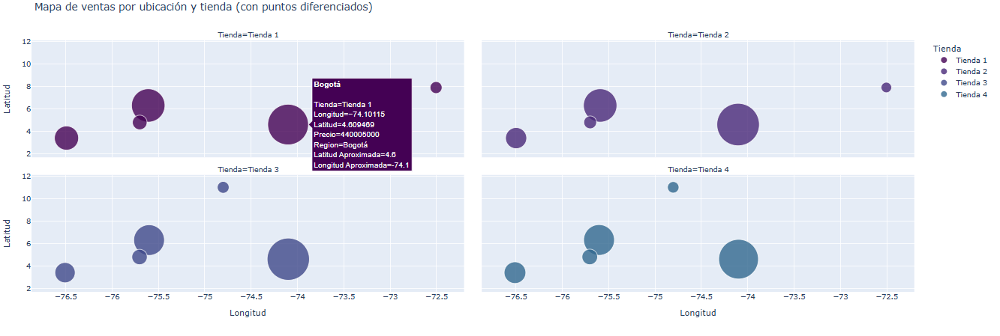

# 📊 Análisis Comparativo de Rendimiento: Alura Store Latam

Este proyecto de **análisis de datos** se centra en evaluar información sobre ventas, categorías de productos, precios y costos de envío en las tiendas de **Alura Store Latam**. El objetivo es **identificar la tienda menos eficiente** y emitir una **recomendación sobre cuál sucursal debería vender el Sr. Juan**, propietario de la cadena, que busca iniciar un nuevo emprendimiento.

---

## 💻 Datos y Requisitos de Análisis

Se evaluaron las 4 tiendas de Alura Store considerando los siguientes aspectos:

* **Métricas Financieras:** Ingresos totales por tienda.
* **Comportamiento de Ventas:** Categorías y productos más vendidos en cada sucursal.
* **Experiencia del Cliente:** Evaluación de reseñas y puntuación de satisfacción.
* **Eficiencia Logística:** Análisis del costo de envío promedio.
* **Rendimiento General:** Comparación de la eficiencia de ventas por tienda.

### Requisitos Cumplidos

1. **Manipulación de Datos:** Carga y limpieza de datos CSV usando **Pandas**.
2. **Visualización de Datos:** Creación de gráficos claros con **Matplotlib** y **Seaborn**.
3. **Recomendación Final:** Conclusión basada en evidencia de los datos.

---

## 🛠️ Tecnologías y Dependencias

| Herramienta / Librería | Descripción |
| :--- | :--- |
| **Python** | Lenguaje principal del proyecto |
| **Pandas** | Manipulación y análisis de datos |
| **NumPy** | Operaciones numéricas eficientes |
| **Matplotlib / Seaborn / Plotly / Folium / Nominatim** | Visualización de datos estáticos e interactivos |
| **Jupyter Notebook / Google Colab** | Entorno de desarrollo interactivo |

---

## 📂 Estructura del Repositorio

```
Python-para-Data-Science-Challenge-AluraStore/
│
├── datasets/ # CSV conjuntos de datos usados para el projecto
│
├── docs/ # documentacion del projecto, graficos, mapas and notas
│  
├── AluraStoreLatam.ipynb/ # Archivo principal que contiene carga de datos, análisis y visualizaciones
│
└── README.md # Instrucciones del proyecto

```

---

## 📊 Visualizaciones Clave

### Ventas por Tienda


### Promedio de Satisfacción de Clientes
.png)

### Costos de Envío Promedio


### Categorías de produtos Más Vendidas


---

## 💡 Resultados y Conclusiones

| Tienda | Ingresos 💰 | Satisfacción ⭐ | Coste de Envío 🚚 | Comentario |
| :--- | :---: | :---: | :---: | :--- |
| Tienda 1 | Alto | Bajo | Alto | Buen ingreso pero clientes insatisfechos y alto coste |
| Tienda 2 | Medio-Alto | Medio | Medio | Equilibrada, la más eficiente |
| Tienda 3 | Medio | Alto | Medio | Buenas reseñas, ingresos moderados |
| Tienda 4 | Bajo | Bajo | Bajo | La menos eficiente, recomendable vender |

**Conclusión Principal:**  
La **Tienda 4** es la menos eficiente dentro de la cadena Alura Store. Su bajo desempeño en ventas y satisfacción del cliente no compensa su menor coste de envío. Se recomienda venderla y enfocar los recursos en **Tienda 2** y **Tienda 3**, optimizando la rentabilidad y el crecimiento del nuevo emprendimiento del Sr. Juan.

---

## 🔎 Extra Análisis Regional

Las ventas se concentran principalmente en grandes ciudades como **Bogotá, Medellín y Cali**, donde se registran los precios más altos. Ciudades como **Cúcuta, Pereira (AMCO) y Barranquilla** muestran montos de venta más bajos, lo que sugiere que la demanda o capacidad de compra es más fuerte en los principales centros urbanos.

En términos de tiendas:

- **Tienda 1:** lidera en casi todas las regiones, mostrando ventaja competitiva y buena penetración en mercados urbanos.  
- **Tienda 3 y 4:** enfocadas en segmentos más económicos o con menor cobertura.

---
### Mapa de mayores ventas por tienda

[Ver gráfico interactivo](https://yaramirezte.github.io/Python-para-Data-Science-Challenge-AluraStore/grafico_ventas_tiendas.html)
